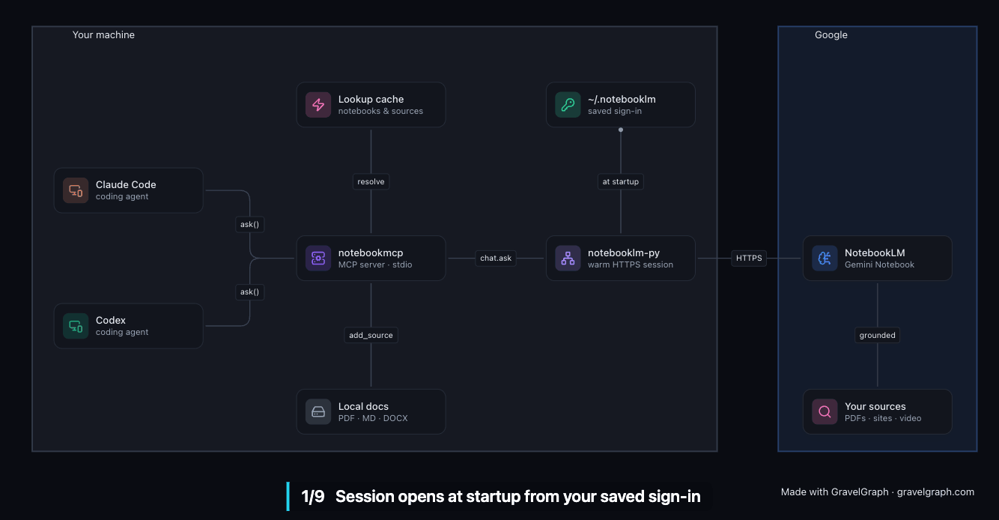

<div align="center">

# NotebookMCP

**Ask your NotebookLM notebooks from Claude Code and Codex.**<br>
Your documents stay in NotebookLM. Only the answers come back into context.

[](https://github.com/REllwood/NotebookMCP/actions/workflows/ci.yml)




<sub>Architecture of the request flow, drawn as a <a href="https://github.com/safishamsi/graphify">graphify</a> knowledge graph of this repo.</sub>

</div>

---

## Why

Coding agents are at their best with a small, focused context. The usual way to give
one project knowledge (specs, API references, research, meeting notes) is to paste it
in or have the agent read the files. That burns thousands of tokens per document and
the agent carries them around for the rest of the session.

[NotebookLM](https://notebooklm.google.com) already indexes your sources and answers
questions about them with citations. NotebookMCP turns that into a tool call. The agent
asks a question and gets back a short, cited answer. It never has to read the
documents itself.

| Without NotebookMCP | With NotebookMCP |
| --- | --- |
| The agent reads `spec.pdf`, `api.md`, `research/*.pdf` into context | The agent calls `ask("How do refresh tokens rotate?")` |
| Tens of thousands of tokens, re-sent every turn | A few hundred tokens: the answer plus its sources |
| Answers blend your docs with the model's memory | Answers come only from your sources, with `[n]` citations |

## Features

- **Small footprint.** Six tools whose definitions total about 850 tokens. Results are
  plain text with no JSON wrapping and no fields the agent can't use.
- **Fast.** One authenticated session opens when the server starts and stays warm. It
  talks straight to NotebookLM over HTTPS, with no headless browser. Notebook and source
  lists are cached, so follow-up questions skip the lookups.
- **Notebooks by name.** Pass `"specs"` instead of a UUID. Leave it out and the server
  reuses the notebook you asked last.
- **Uploads that bypass the chat.** Point `add_source` at a PDF, a Markdown file or a
  whole `docs/` folder. The server reads the files from disk and uploads them, so their
  contents never pass through your agent's context.
- **Two-command setup.** `notebookmcp setup` signs you in with your existing browser
  session and registers the server with Claude Code and Codex.

## Quick start

You need [uv](https://docs.astral.sh/uv/getting-started/installation/) and a Google
account you've used [NotebookLM](https://notebooklm.google.com) with in your browser.

```bash
uv tool install git+https://github.com/REllwood/NotebookMCP
```

```bash
notebookmcp setup
```

`setup` does three things:

1. It signs you in by copying your NotebookLM session from your browser. On macOS you'll
   see a Keychain prompt asking to read the browser's cookie store; allow it.
2. It registers the server with Claude Code (user scope) and Codex, whichever you have
   installed.
3. It prints your notebooks so you can see it worked.

Restart your agent and try:

> Ask my **Product Specs** notebook how refresh tokens rotate.

<details>
<summary><b>Manual setup and other MCP clients</b></summary>

<br>

Sign in once:

```bash
notebookmcp login
```

**Claude Code**

```bash
claude mcp add --scope user notebooklm -- notebookmcp
```

**Codex**

```bash
codex mcp add notebooklm -- notebookmcp
```

or in `~/.codex/config.toml`:

```toml
[mcp_servers.notebooklm]
command = "notebookmcp"
```

**Claude Desktop, Cursor, Windsurf and other JSON-configured clients**

```json
{
  "mcpServers": {
    "notebooklm": { "command": "notebookmcp" }
  }
}
```

Desktop apps often don't inherit your shell's `PATH`. If the server doesn't start, use
the absolute path from `which notebookmcp`.

**Run without installing**

```bash
claude mcp add --scope user notebooklm -- uvx --from git+https://github.com/REllwood/NotebookMCP notebookmcp
```

</details>

## Tools

| Tool | Arguments | What it does |
| --- | --- | --- |
| `ask` | `question`, `notebook?`, `sources?`, `quotes?` | Asks a notebook a question. NotebookLM answers from its sources only, with `[n]` citations. Questions to the same notebook share one chat, so follow-ups work. |
| `search` | `query`, `notebook?`, `limit?` | Returns the best-matching passages word for word, with no AI summary. Good for exact wording, numbers and code. |
| `list_notebooks` | | Your notebooks, their source counts and ids. |
| `list_sources` | `notebook?` | The sources in a notebook, with their type and status. |
| `add_source` | `url` \| `path` \| `text`, `title?`, `notebook?` | Adds a web page or YouTube link, a local file or folder, or pasted text. Waits up to 45 s for a single source to index. |
| `create_notebook` | `title` | Creates an empty notebook and makes it the current one. |

`notebook` accepts a title, part of a title, or an id. `sources` accepts source titles or
ids. Local uploads take `.pdf`, `.md`, `.txt`, `.docx`, `.pptx`, `.csv` and `.epub`.
Other plain-text files are added as pasted text. Folder uploads skip `.git`,
`node_modules`, virtualenvs and build output, and stop at 50 files.

An `ask` result looks like this:

```text
Access tokens expire after 15 minutes [1]. Refresh tokens last 30 days and are
rotated on every use, so a replayed token revokes the whole family [2][3].

Sources: [1] Auth Design Doc · [2, 3] API Reference
```

## Configuration

| Variable | Purpose |
| --- | --- |
| `NOTEBOOKMCP_NOTEBOOK` | Notebook to use when a call doesn't name one. `notebookmcp setup --notebook "Product Specs"` sets it for you. |
| `NOTEBOOKMCP_PROFILE` | Which signed-in profile to use, if you have more than one Google account. |
| `NOTEBOOKLM_HOME` | Where the session is stored. Defaults to `~/.notebooklm`. |

Set them with `-e` in `claude mcp add`, `--env` in `codex mcp add`, or the `env` block
of a JSON config.

## Commands

```text
notebookmcp            run the MCP server on stdio (what your agent launches)
notebookmcp setup      sign in and register with Claude Code and Codex
notebookmcp login      sign in again, or switch accounts
notebookmcp status     check the session and list your notebooks
```

`login` passes extra flags to the underlying sign-in, so these work too:

```bash
notebookmcp login --browser-cookies chrome           # choose which browser to read
notebookmcp login --account you@example.com --browser-cookies
```

## How it works

1. Your agent launches `notebookmcp` as a stdio MCP server and sees six tools.
2. On start, the server opens one NotebookLM session in the background using the
   cookies saved by `login`, so the first call doesn't wait for a handshake.
3. A tool call resolves the notebook by name from a cached list, then sends a single
   request to NotebookLM's web API through
   [notebooklm-py](https://github.com/teng-lin/notebooklm-py).
4. NotebookLM answers from your sources with Gemini. The server condenses the reply to
   the answer text and a one-line source list, and returns it to the agent.

## Privacy and caveats

- **Your session stays local.** `login` stores NotebookLM cookies under `~/.notebooklm`
  on your machine. Treat that folder like a password. The server only talks to Google.
- **Unofficial API.** Google offers no public NotebookLM API for personal accounts, so
  this uses the web app's internal API via notebooklm-py. Google can change it without
  notice. If calls start failing, upgrade with `uv tool upgrade notebookmcp`.
- **Gemini Notebook.** Google renamed NotebookLM to Gemini Notebook in July 2026. It's
  the same service, and this works with both names.
- This project isn't affiliated with or endorsed by Google.

## Troubleshooting

| Symptom | Fix |
| --- | --- |
| `Not signed in to NotebookLM` | Run `notebookmcp login`. |
| `session has expired` | Run `notebookmcp login` again. The server picks up the new session without a restart. |
| Sign-in reads the wrong Google account | `notebookmcp login --account you@example.com --browser-cookies` |
| The tools don't appear in your agent | Restart the agent, then check `claude mcp list` or `/mcp` in Codex. |
| A desktop app can't start the server | Use the absolute path from `which notebookmcp` as the command. |
| `add_source` says it's still indexing | Large files take a minute. Ask again shortly. |

## Development

```bash
git clone https://github.com/REllwood/NotebookMCP
cd NotebookMCP
uv sync
uv run pytest
```

The tests run against an in-memory stand-in for NotebookLM, plus one test that launches
the real server over stdio, so they need no Google account.

<br>

<div align="center">
<sub>
The architecture animation at the top is a <b>graphify graph</b>: a knowledge graph
that <a href="https://github.com/safishamsi/graphify">graphify</a> built from this
repo's code and README, animated to trace one question from your agent to NotebookLM
and back.
</sub>
</div>
